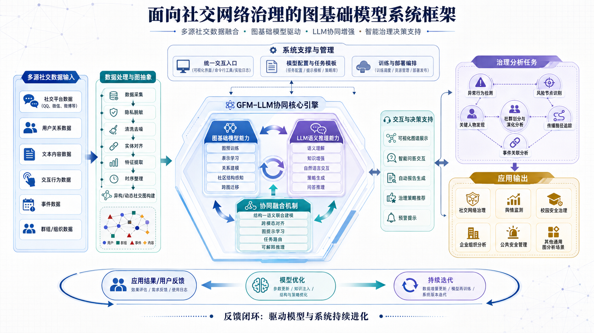

# SocialGraph-FM

面向社交网络治理的本地图基础模型工作台：把真实 GFM 推理、关系证据、协同行为线索、案例检索和人工复核组织在同一套可追溯流程中。



## 🌟主要能力

- 导入 CSV、JSON、GraphML 和 GEXF，完成字段映射、质量校验、图谱浏览与会话恢复。
- 根据输入的图数据，转换成可视化可交互的图谱，增进社交网络理解。
- 完成 zero-shot / few-shot 目标域适配，保留 checkpoint、图版本和来源哈希。
- 查看重点账号、协同群组、事实关系、潜在线索、证据子图和相似复核案例。
- 使用大模型生成受证据约束的问答、摘要和研判报告，再由人员记录结论并导出报告。

## ⚙️环境要求

- Windows x64 或 Ubuntu x64
- 64 位 CPython 3.12.x
- 一个可用的大模型 API 与对应的模型 ID、API Key

公开运行版固定使用 CPU。普通用户不需要 CUDA、Node.js、npm、Conda，也不需要自行安装训练或研究依赖。`onboard` 会创建唯一的项目内隔离环境并安装锁定依赖；其中 PyTorch CPU、PyG 和 `pyg-lib` 用于真实图模型与固定邻居采样。

项目支持任意符合上述平台要求的 CPython 3.12 补丁版本，但**不支持 3.12 以外的主／次版本**。当前安装锁、预编译 wheel、启动器和 CI 均以 3.12 为发布基线。

## 🚀三步启动

1. 克隆仓库，或从 GitHub 选择 **Code → Download ZIP** 并解压：

```console
git clone https://github.com/Jinhui524/SocialGraph_FM.git
cd SocialGraph_FM
```

2. 在仓库根目录完成环境与大模型配置（Ubuntu 可将 `python` 换成 `python3`）：

```console
python scripts/socialgraph.py onboard
```

3. 启动系统：

```console
python scripts/socialgraph.py start
```

浏览器访问 `http://127.0.0.1:5173`。使用结束后停止受管进程：

```console
python scripts/socialgraph.py stop
```

需要重新配置大模型或检查安装时运行：

```console
python scripts/socialgraph.py configure-llm
python scripts/socialgraph.py doctor
```

## 📁配置大模型

向导先让用户选择服务商，再预填对应 API 地址。模型 ID 不设易过期的默认值，始终由用户从服务商控制台复制；API 地址仍可编辑。

| 选择 | 服务商                   | 预填 API 地址                                             |
| ---: | ------------------------ | --------------------------------------------------------- |
|    1 | OpenAI 官方              | `https://api.openai.com/v1`                               |
|    2 | DeepSeek 官方            | `https://api.deepseek.com`                                |
|    3 | 通义千问                 | `https://dashscope.aliyuncs.com/compatible-mode/v1`       |
|    4 | Gemini OpenAI-compatible | `https://generativelanguage.googleapis.com/v1beta/openai` |
|    5 | MiniMax 中国             | `https://api.minimaxi.com/v1`                             |
|    6 | MiniMax 国际             | `https://api.minimax.io/v1`                               |
|    7 | OpenRouter               | `https://openrouter.ai/api/v1`                            |
|    8 | 自定义 OpenAI-compatible | 由用户填写                                                |

无论选择哪一项，最终只需确认三项：

```text
大模型 API 地址
模型 ID
API Key
```

向导隐藏 API Key，并在保存前进行真实连通验证；验证失败不会保存。Qwen 业务空间用户可以把预填地址替换为控制台提供的专属 OpenAI-compatible 地址。现有中转服务继续通过“自定义 OpenAI-compatible”配置。

如果 LLM 连通验证失败，已经验证完成的 CPU 环境、模型和运行资源会继续保留，不需要重新下载。先运行 `python scripts/socialgraph.py doctor` 查看本地环境状态；本地 runtime 正常时，修正地址、模型或密钥后直接运行 `python scripts/socialgraph.py configure-llm`。网络诊断码与恢复方法见[技术参考](docs/REFERENCE.md#llm-连接诊断与恢复)。

OpenAI 官方配置需要从 [OpenAI API Platform](https://platform.openai.com/api-keys) 创建 API Key，并单独开通 API 用量；ChatGPT 或 Codex 的订阅、登录凭据不能替代 API Key。API Key 写入 Git 忽略的私有配置，只注入 API 进程，不进入浏览器、GFM 进程、日志或 Git。

## 🧭快速使用示例

完成 `onboard` 和 `start` 后，打开 `http://127.0.0.1:5173` 即可使用仓库自带的示例文件。下面以 `russia-04.zip` 为例；Russia 示例的实际文件名为：

```text
examples/governance/russia/russia-01.zip
examples/governance/russia/russia-02.zip
examples/governance/russia/russia-03.zip
examples/governance/russia/russia-04.zip
```

### 示例一：使用 Russia 04 完成一次治理分析

1. 进入左侧的“对话研究”，点击输入框旁的附件按钮。
2. 选择 `examples/governance/russia/russia-04.zip`。系统会先检查推理包的来源、模型合同和图谱身份。
3. 页面提示推理包已登记后，在对话框输入：

```text
开始分析
```

4. 检查系统生成的分析计划，点击“确认开始分析”。完成后即可在“治理应用”中查看风险候选、协同群组、事实关系、潜在线索和证据子图。
5. 打开“研判助手”，可以继续生成全局态势报告、账号证据报告或人工研判草稿。

可以直接尝试以下自然语言问题：

```text
请概括当前图谱的账号规模、事实关系数量、关系类型和连通情况。

当前网络中有哪些账号或协同群组需要优先人工复核？请说明证据和建议的核验顺序。

请生成当前网络的全局态势报告，重点列出高关注候选、关系证据和下一步人工复核顺序。

如果要人工复核这张图，应该按什么步骤进行？

请区分当前结果中的图事实、模型风险排序和仍需人工核验的潜在线索。
```

在治理应用中选中一个账号后，还可以输入：

```text
请总结当前选中账号的主要证据，并区分已登记事实关系和潜在线索。
```

完成对话研究后，可以继续参照“示例三”进入治理应用核对证据并记录人工结论。

### 示例二：运行零样本与少样本适配

`onboard` 会把两个目标域示例准备到以下位置：

| 适配方式 | 选择的文件                                                   | 适用情况                                     |
| -------- | ------------------------------------------------------------ | -------------------------------------------- |
| 零样本   | `var/examples/target-domain/target-domain-a-zero.sgtask.zip` | 新网络暂时没有可靠标签，用于完成全网初筛     |
| 少样本   | `var/examples/target-domain/target-domain-b-few.sgtask.zip`  | 已有少量核对标签，用于调整目标网络的复核顺序 |

进入左侧“适配能力”后：

1. 在“跨域新活动 · 零样本”中点击“选择目标任务包”，上传 `target-domain-a-zero.sgtask.zip`，然后点击“确认分析”。
2. 在“稀缺标注 · 少样本”中点击“选择目标任务包”，上传 `target-domain-b-few.sgtask.zip`，然后点击“确认分析”。
3. 分析完成后，可以在右侧切换零样本与少样本图谱，并点击“进入治理应用”继续核对候选账号、群组和关系证据。

Russia 文件是 Governance 推理包，应从“对话研究”上传；zero-shot／few-shot 文件是目标任务包，应从“适配能力”对应入口上传。两类文件不要互换。模型输出只用于辅助安排人工复核顺序，不会把潜在线索自动登记为事实关系。

完成适配分析后，可以继续参照“示例三”进入治理应用。少样本任务会显示经过校验的适配后复核顺序，但不会改变原始图事实或基础模型权重。

### 示例三：在治理应用中完成证据核验与人工复核

无论前面使用的是 Russia 推理包、零样本任务还是少样本任务，只要分析已经完成，就可以进入“治理应用”。如果来自“适配能力”，可直接点击对应结果下方的“进入治理应用”。下面以复核一个高关注账号为例：

1. **选择待复核账号**

   打开“风险节点”，在“待复核”列表中选择一个排序靠前的账号，然后点击“查看证据”。风险排序只决定建议的复核先后顺序，不代表该账号已经被人工确认。

2. **检查证据档案**

   证据档案包含三个页面：

   - “证据摘要”：先查看结构化摘要；账号对象还可以点击“生成证据研判摘要”，让大模型按已绑定事实整理关注原因和核验建议。
   - “关系事实”：核对一跳关联账号、关系模态、权重、融合度数和两跳节点。发布时间、原帖内容及采集来源仍需人工从外部材料补充核验。
   - “人工复核”：把当前账号加入研判单，填写复核理由并选择“确认”“驳回”或“待定”。

   例如，当前只确认了图结构和关系模态，但还没有核对原帖语境时，可以填写：

   ```text
   已核对当前账号的一跳关系及 coRT、coURL 关系模态；现有证据尚未包含原帖内容、发布时间和采集来源，需要补充语境核验，暂记为待定。
   ```

   点击“加入并开始复核”，填写上述理由后选择“待定”。获得充分的外部证据后，再根据实际核验结果选择“确认”或“驳回”。

3. **核对群组与关系**

   返回治理工作面并打开“群组与关系”，依次查看：

   - “风险群组”：检查群组成员及内部关系模态；
   - “事实关系”：查看数据中已经登记的关系边；
   - “潜在线索”：查看模型或图结构派生的候选关系，这些内容会明确标为“非事实边”。

   选择群组或关系后同样可以点击“查看证据”，并把需要持续跟进的对象加入当前研判单。

4. **生成研判报告并检索历史案例**

   打开“研判助手”，可以选择：

   - “全局态势报告”：总结当前网络、重点候选、群组和关系；
   - “当前账号证据报告”：需要先选中一个风险账号；
   - “群组与关系研判报告”：区分风险群组、事实关系和潜在线索；
   - “人工研判草稿”：需要先建立或选择研判单。

   报告生成后可展开“依据来源”，查看本次调用使用的图谱概况、证据、关系及来源哈希。大模型报告仍是待人工复核的预览，不会自动写成人工结论。

   切换到“历史案例”，点击“检索相似历史案例”，可以查看与当前账号或研判单接近的已审结案例及语义、结构、关系相似度。如果研判单还没有治理对象，应先完成第 2 步。

5. **形成结论并导出**

   打开“研判单”，检查治理对象、已复核数量和待复核数量。全部对象复核完成后点击“形成结论”，随后可以导出 `HTML` 或 `Markdown` 报告；不再使用的研判单可以继续“归档”，需要补充核查时可重新打开。

   右上方的“运行记录”可以重新打开当前会话中已经成功保存的分析结果，继续查看候选、证据和研判单。

一个完整的推荐流程是：

```text
分析完成 → 风险节点 → 查看证据 → 加入研判单 → 记录人工结论
        → 核对群组与关系 → 生成研判报告／检索历史案例
        → 形成结论 → 导出 HTML 或 Markdown
```

治理应用中的模型排序、智能摘要和潜在线索都只用于辅助人工研判。最终结论必须以可核对的图事实、外部语境证据和人工记录为依据。

## 🎮研判 Assistant Skills

这些只读 Skills 必须调用已配置的大模型

| Skill                              | 界面功能                   | 使用的治理能力                         |
| ---------------------------------- | -------------------------- | -------------------------------------- |
| `answer_governance_question`       | 对话研究与研判助手自由追问 | 按问题选择允许的只读 Governance Skills |
| `summarize_node_evidence`          | 治理应用“智能证据研判”     | 图谱概况、证据子图、关系排序           |
| `generate_global_situation_report` | 研判助手“全局态势报告”     | 图谱概况、群组、事实关系、潜在线索     |
| `generate_account_evidence_report` | “当前账号证据报告”         | 图谱概况、证据子图、事实与潜在关系     |
| `generate_coordination_report`     | “群组与关系研判报告”       | 图谱概况、协同群组、关系排序           |
| `generate_case_review_draft`       | “人工研判草稿”预览         | 当前研判单、证据、群组和关系           |

## 📝Governance Skills

| Skill                          | 作用                           | 权限       |
| ------------------------------ | ------------------------------ | ---------- |
| `inspect_graph`                | 查看图规模、关系模态与覆盖情况 | 只读       |
| `run_governance_analysis`      | 准备并运行 Global 治理分析     | 执行前确认 |
| `get_evidence_subgraph`        | 获取账号绑定的证据子图         | 只读       |
| `discover_coordination_groups` | 分页查看协同群组               | 只读       |
| `rank_coordination_relations`  | 排序事实关系与潜在线索         | 只读       |
| `retrieve_similar_cases`       | 检索已审结的相似案例           | 只读       |
| `get_model_dataset_cards`      | 查看模型、数据与输入合同       | 只读       |
| `draft_review_report`          | 生成可保存的确定性案件草稿     | 保存前确认 |

每个 Skill 的输入、输出、界面位置、底层调用、失败行为和实现路径见 [Skills 索引](skills/README.md)。`skills/governance/catalog.json` 仍是 8 个底层 Governance Skills 的唯一机器源。

## 🔧项目结构

```text
apps/web/             React 前端源码（普通用户运行预构建版本）
services/api/         API、LLM 边界、状态与确认
packages/gfm/         图模型推理、适配、检索与治理 Skills
packages/runtime/     单环境安装与两进程生命周期
bundles/              模型、治理索引和预构建 Web
examples/governance/  Russia 与目标域示例
skills/               Assistant、Governance 和实验 Core Skills
docs/                 中文技术参考与实验状态
scripts/              用户入口和发布校验工具
var/                  Git 忽略的环境、凭据、日志和用户状态
```

普通用户只运行 API/Web 和 GFM 两个回环进程：API 在 `127.0.0.1:5173` 提供接口及静态页面，GFM 在内部 `127.0.0.1:8766` 提供隔离推理。开发 Web 源码时才需要 Node/npm。

## 📄使用边界

SocialGraph-FM 是本地研究和辅助决策系统，不是托管监控或自动执法服务。使用者需要自行保证数据权利、合法用途、目标域验证、语境核验和最终人工决策。普通图的结构统计不会被标记成模型预测，潜在线索也不会被标记成已登记事实关系。

`docs/status/readiness.json` 只描述实验 Core 研究门禁，不代表 Governance 用户运行版不可用。更多安装锁、模型身份、API、研究依赖和排障信息见 [技术参考](docs/REFERENCE.md)。

## 🤝许可证与引用

本项目采用 MIT 许可证 - 查看 [LICENSE](https://github.com/Jinhui524/SocialGraph_FM/blob/main/LICENSE) 文件了解详情。

## 📞 联系方式

如有问题或建议，请通过以下方式联系：

- 项目Issues：[GitHub Issues](https://github.com/Jinhui524/SocialGraph_FM/issues)
- 邮箱：请通过GitHub Issues联系
